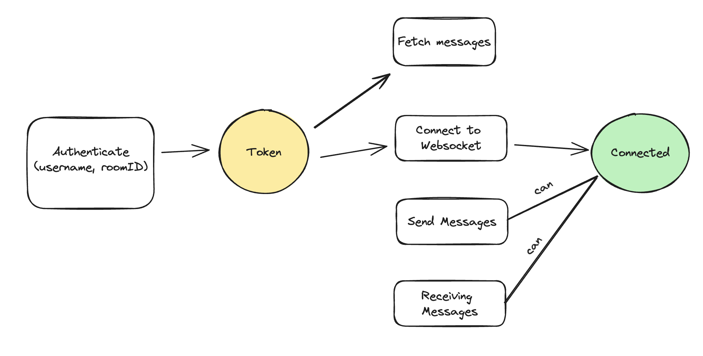
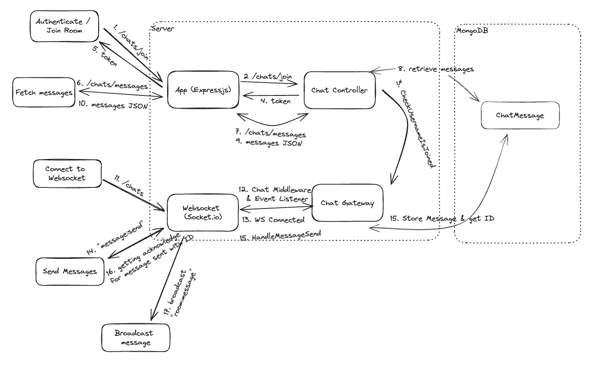

# Chat App

## Submission
1. Submitted at Wed, 25 Oct 2023
2. How to run locally? check the [Get Started](#get-started) Section
3. Time spent: 30 hours

4. Assumption & Compromises:

- the user will not open the webapp in multi-tab (so the session is stored in [SessionStorage](https://developer.mozilla.org/en-US/docs/Web/API/Window/sessionStorage)).

> because we dont allow joining same username in same room, so in this case we dont store the session in localStorage because the person A may have session in browser A, and then close the browser, and then other person B able to authenticate with same username, but the session on person A might be able to reconnect when the browser is opened again.
> SessionStorage will only persist the data on active tab of the browser, when the tab is closed its data is destroyed, so there will be no case to allow same username in the room

- backend not running on clustering / multi-container
> by not running on clustering we can store the active user in-memory to check wether the user is already inside the room or not, but if we will running on clustering / multi-container we will need to persist the active user to the database, so other application instance will have access to the current active user
=

5. What would be your approach to ensuring the application is ready for production (testing)?
> Create testing, Load / Performance Testing run security analysis with tools like sonarqube
6. How would you ensure a smooth user experience as 1000’s of users start using your app simultaneously?
> 1. Apply pagination (infinity scroll) for very older messages
> 2. Apply caching in the frontend to reduce api calls (fetching messages: even in this code we only fetch one after authentication succeed)
> 3. Handle all the loading in the UI, and apply lock mechanism in the backend to ensure no race-condition bug/error
> 4. As websocket connection might be unstable because of the client's connection (Wifi connection, 4G). Reconnection handling is a must, socket.io already provide reconnection and state recovery
7. What key steps would you take to ensure application security?
> 1. Always aware of the secret variable/data (Just never commit it)
> 2. Make sure to apply authentication on every service
> 3. Make sure to apply authorization on every action
> 4. Use tooling like eslint-plugin-security, sonarqube to analyze security


## Overview

The process is described as these step:

the overview from the UI side is described as this:


the overview for the Server side is described as this:


## About Backend

### Developed using
- Express JS for the router
- Socket IO for the websocket server
- Mongoose for MongoDB ORM
- Pino js for logger

- esbuild for bundle into production ready and converting ESM to commonJS
- ESLint, Prettier for linting and code formatting
- Typescript for strict language
- Jest for testing


## About Frontend

### Develop using
- React and Vite for development tool
- TailwindCSS for styling
- React Hook Form for managing form state and validating form
- Zod for validation schema
- Zustand for global state management
- Socket IO Client for connecting to Backend Websocket
- Axios for HTTP Client

## Get Started

### Docker Compose

the compose file includes `Mongodb` and `Redis` container

1. Just start the services by running
```bash
docker-compose up -d
```

### Manual

#### Requirements

1. Nodejs version >= 18
2. Mongodb
3. Redis (optional)

#### Backend

1. Go to the backend directory
```bash
cd backend
```

2. Install dependencies
```bash
npm install
```

3. Setup env variables. you will need to set the variable for `MONGO_URI` and `JWT_SECRET` for minimum setup
```
cp .env.example .env
```

4. Run development
```bash
npm run dev
```

5. Run test
```bash
npm run test
```

6. Build for production
```bash
npm run build

# start the production built by running:
npm run start
```

#### Frontend

1. Go to the web directory
```bash
# dont forget to "cd .." if you are still in backend directory

cd web
```

2. Install dependencies
```bash
npm install
```

3. Setup env variables. you will need to set the variable for `VITE_WS_URI` and `VITE_API_URL` to the backend url
```bash
cp .env .env.example
```

4. Run development
```bash
npm run dev
```

5. Build for produciton
```bash
npm run build

# the static built will be inside dist/ directory
```
